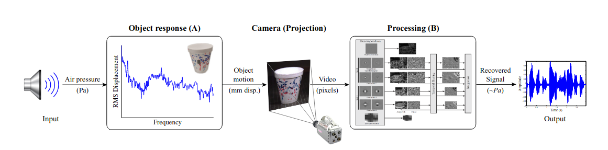

# Visual-Mic

[](https://github.com/joeljose/Visual-Mic/actions/workflows/ci.yml)

A Python implementation of the [Visual Microphone](https://people.csail.mit.edu/mrub/VisualMic/) algorithm, which recovers sound from high-speed video by analyzing sub-pixel surface vibrations. When sound hits an object, it causes tiny vibrations on the surface—far too small to see with the naked eye, but detectable in the phase of complex wavelet coefficients. This tool extracts those vibrations and reconstructs an audible signal, effectively turning everyday objects into microphones.

The original work by [Davis et al. (MIT CSAIL, SIGGRAPH 2014)](https://people.csail.mit.edu/mrub/papers/VisualMic_SIGGRAPH2014.pdf) used Complex Steerable Pyramids for the video decomposition. This project uses **2D Dual-Tree Complex Wavelet Transform (DTCWT)** instead, which is ~5x more computationally efficient while still providing reliable phase information for motion estimation. We test against the same high-speed videos provided by MIT CSAIL.

The sample videos can be downloaded from [here](https://data.csail.mit.edu/vidmag/VisualMic/). For example, `Chips1-2200Hz-Mary_Had-input.avi` is a high-speed video of a bag of chips vibrating to "Mary Had A Little Lamb" (704x704, 22,859 frames captured at 2200 fps, ~14 GB). **Note:** the AVI container reports ~30 fps, but the actual capture rate is 2200 Hz — use `--fps 2200` when running `visualmic.py` to get the correct audio sample rate.



---

## Table of Contents

- [Setup](#setup)
  - [A. Local Setup](#a-local-setup)
  - [B. Docker (CPU)](#b-docker-cpu)
  - [C. Docker (GPU)](#c-docker-gpu)
- [Usage](#usage)
  - [CLI Tool](#cli-tool)
  - [Tips](#tips)
- [GPU Acceleration](#gpu-acceleration)
  - [Batched DTCWT Architecture](#batched-dtcwt-architecture)
  - [GPU Phase Extraction](#gpu-phase-extraction)
  - [Memory Management](#memory-management)
  - [Performance](#performance)
- [Part 1: The Original Work (Davis et al., SIGGRAPH 2014)](#part-1-the-original-work-davis-et-al-siggraph-2014)
  - [1.1 The Physical Phenomenon](#11-the-physical-phenomenon)
  - [1.2 Why Not Just Track Pixels?](#12-why-not-just-track-pixels)
  - [1.3 The Key Insight: Phase = Motion](#13-the-key-insight-phase--motion)
  - [1.4 Complex Steerable Pyramid](#14-complex-steerable-pyramid)
  - [1.5 The Original Algorithm](#15-the-original-algorithm--step-by-step)
  - [1.6 Rolling Shutter Trick](#16-rolling-shutter-trick-consumer-cameras)
  - [1.7 Limitations](#17-limitations-of-the-original)
- [Part 2: Our Implementation (2D DTCWT)](#part-2-our-implementation-2d-dtcwt)
  - [2.1 What is the DTCWT?](#21-what-is-the-dual-tree-complex-wavelet-transform)
  - [2.2 DTCWT vs Steerable Pyramid](#22-dtcwt-vs-complex-steerable-pyramid)
  - [2.3 Algorithm Mapped to Code](#23-our-algorithm--mapped-to-code)
  - [2.4 Parameters](#24-parameters-used)
  - [2.5 What Each Scale Captures](#25-what-each-scale-captures)
- [Part 3: Literature Survey](#part-3-literature-survey)
- [Future Work](#future-work)
- [Development](#development)
  - [Running Tests](#running-tests)
  - [Versioning](#versioning)
  - [Project Structure](#project-structure)
- [References](#references)

---

## Setup

### A. Local Setup

```bash
git clone https://github.com/joeljose/Visual-Mic.git
cd Visual-Mic
pip install -r requirements.txt
python visualmic.py -i testvid.avi -o recovered_audio.wav
```

**Requirements:** Python 3.8+

### B. Docker (CPU)

```bash
# Build
./docker-build.sh

# Run
docker run --rm --user "$(id -u):$(id -g)" -v /path/to/videos:/data \
    visual-mic:latest \
    -i /data/testvid.avi -o /data/sound.wav
```

### C. Docker (GPU)

Requires [nvidia-container-toolkit](https://docs.nvidia.com/datacenter/cloud-native/container-toolkit/latest/install-guide.html).

```bash
# Build
./docker-build-gpu.sh

# Run
docker run --rm --gpus all --user "$(id -u):$(id -g)" -v /path/to/videos:/data \
    visual-mic-gpu:latest \
    --gpu -i /data/Chips1-2200Hz-Mary_Had-input.avi \
    -o /data/sound.wav --fps 2200 --batch-size 32
```

The `--batch-size` flag controls how many frames are processed per GPU batch (default: 16). Larger batches are faster but use more GPU memory. At 704x704, each frame uses ~10 MB of GPU memory, so `--batch-size 32` needs ~660 MB including overhead.

**Note:** GPU mode produces very similar but not bit-identical output compared to CPU mode, due to float32 vs float64 precision differences and different DTCWT implementations (`pytorch_wavelets` vs `dtcwt`).

---

## Usage

### CLI Tool

```bash
# Basic usage
python visualmic.py -i testvid.avi -o recovered_audio.wav

# With temporal bandpass filter
python visualmic.py -i testvid.avi -fl 80 -fh 1000

# With ROI (focus on vibrating object)
python visualmic.py -i testvid.avi --roi 100,50,200,150

# Override frame rate for high-speed video
python visualmic.py -i Chips1-2200Hz-Mary_Had-input.avi --fps 2200

# GPU acceleration
python visualmic.py -i testvid.avi --gpu --batch-size 32

# Custom wavelet filters
python visualmic.py -i testvid.avi --biort near_sym_a --qshift qshift_a
```

| Flag | Default | Description |
|---|---|---|
| `-i / --input` | *(required)* | Input video path |
| `-o / --output` | `sound.wav` | Output audio path |
| `-fl / --freq-low` | fps/40, clamped to 20–100 Hz | Lower cutoff frequency (Hz) for temporal bandpass filter |
| `-fh / --freq-high` | — | Upper cutoff frequency (Hz) for temporal bandpass filter |
| `--no-filter` | off | Disable the default high-pass (raw phase signals) |
| `--denoise` | off | Spectral subtraction of stationary noise (hum, light flicker, sensor noise) |
| `--fps` | — | Override video frame rate (Hz) for audio sample rate |
| `--roi` | — | Region of interest as `x,y,w,h` |
| `--gpu` | off | Use GPU-accelerated DTCWT (requires CUDA + pytorch_wavelets) |
| `--batch-size` | 16 | Frames per GPU batch (GPU mode only) |
| `--nlevels` | 3 | Number of DTCWT decomposition levels |
| `--biort` | `near_sym_b` | Biorthogonal wavelet filter for DTCWT level 1 |
| `--qshift` | `qshift_b` | Quarter-shift wavelet filter for DTCWT levels 2+ |
| `--version` | — | Show program version and exit |

**Available wavelet filters:**
- `--biort`: `antonini`, `legall`, `near_sym_a`, `near_sym_b`
- `--qshift`: `qshift_06`, `qshift_a`, `qshift_b`, `qshift_c`, `qshift_d`

A Butterworth high-pass is applied to the phase signals by default, at 1/20 of Nyquist (fps/40) clamped to 20–100 Hz, as in Davis et al. (55 Hz at 2200 fps). It rejects slow drift, which would otherwise swamp the audio. `-fl` and `-fh` set the band explicitly; `--no-filter` turns it off.

When `--denoise` is specified, stationary noise is removed by spectral subtraction. The noise level of each frequency is estimated as its median over the whole clip, so steady hum and light flicker (multiples of 50/60 Hz) are suppressed while the recovered sound, which comes and goes, is kept.

When `--fps` is specified, the given value is used as the audio sample rate instead of the frame rate reported by the video container. This is necessary for high-speed camera footage where the container frame rate does not reflect the actual capture rate.

When `--roi` is specified, each frame is cropped to the given rectangle before the DTCWT decomposition. This reduces computation and can improve SNR by focusing on the vibrating object.

### Tips

- Always pass the true capture rate with `--fps`; the high-pass cutoff and output sample rate depend on it.
- Add `--denoise` for listening; leave it off when you need the raw motion signal.
- Use `--roi` to focus on the vibrating object — improves SNR and reduces computation.
- For MIT CSAIL videos, always use `--fps 2200` (the container reports ~30 fps incorrectly).
- Use `--gpu` for large videos — the DTCWT forward pass is the main bottleneck.
- If GPU runs out of memory, reduce `--batch-size`.

---

## GPU Acceleration

The `--gpu` flag enables GPU-accelerated processing via [PyTorch](https://pytorch.org/) and [`pytorch_wavelets`](https://github.com/fbcotter/pytorch_wavelets). The GPU path replaces the CPU DTCWT forward transform with a CUDA-accelerated batched equivalent while keeping the same algorithmic pipeline. Temporal postprocessing (bandpass filtering, cross-correlation, sub-band summation) remains on CPU/NumPy since it operates on the small phase signal array, not full wavelet coefficients.

### Batched DTCWT Architecture

The GPU path processes frames in configurable batches rather than one at a time:

1. **Batch accumulation**: Grayscale frames are collected into batches of `--batch-size` frames (default: 16)
2. **GPU transfer**: The batch is stacked into a `(B, 1, H, W)` float32 tensor and sent to GPU
3. **Batched forward DTCWT**: `pytorch_wavelets.DTCWTForward` processes all frames in the batch simultaneously, producing `Yh[level]` with shape `(B, 1, 6, H_l, W_l, 2)` where the last dimension is real/imaginary
4. **Phase extraction**: Performed on-GPU for the entire batch (see below)
5. **Transfer back**: Only the small phase signal array `(B, nlevels, 6)` is transferred to CPU — the full wavelet coefficients are discarded
6. **Memory cleanup**: GPU tensors are explicitly deleted (`del batch_tensor, Yl, Yh`) after each batch

This streaming architecture means GPU memory usage is proportional to `batch_size`, not `frame_count` — enabling processing of arbitrarily long videos.

### GPU Phase Extraction

The CPU path uses NumPy's complex number support (`np.angle(coeffs * ref_conj)`). The GPU path must handle complex arithmetic manually because `pytorch_wavelets` represents coefficients as real/imaginary pairs in the last dimension:

```
Yh[level] shape: (B, 1, 6, H, W, 2)
                                   └── [0]=real, [1]=imag
```

**Conjugate multiplication** (phase difference from reference):
```python
# (c + id)(a - ib) = (ca + db) + i(da - cb)
prod_real = c_real * r_real + c_imag * r_imag
prod_imag = c_imag * r_real - c_real * r_imag
```

**Phase and amplitude-squared weighting** (vectorized over entire batch):
```python
phase_diff = torch.atan2(prod_imag, prod_real)
amp_sq = c_real * c_real + c_imag * c_imag
weighted = (amp_sq * phase_diff).sum(dim=(-2, -1))  # sum over H, W
```

This produces the same $A^2$-weighted spatial average as the CPU path, but computed entirely on GPU for the full batch at once.

**Reference frame handling**: The reference frame's coefficients are extracted when the batch containing `ref_index` is processed, then retained as a small GPU tensor for subsequent batches. Frames before the reference produce zero phase signals.

### Memory Management

**Pre-flight VRAM estimation**: Before processing, `estimate_vram()` calculates peak VRAM usage based on batch size and frame dimensions. The DTCWT forward transform requires ~15x the input frame size in working memory (filter banks, intermediate convolutions). If estimated usage exceeds 70% of available VRAM, a warning is printed with suggestions to reduce `--batch-size`, use `--roi`, or switch to CPU mode.

**OOM handling**: If a CUDA out-of-memory error occurs during processing, the tool catches it and exits with an actionable error message rather than a raw PyTorch traceback.

**CPU/GPU output differences**: The GPU path uses float32 (PyTorch/CUDA standard) while the CPU path uses float64. Combined with different DTCWT implementations (`pytorch_wavelets` vs `dtcwt`), outputs are similar but not bit-identical. Both produce valid audio recovery.

### Performance

Benchmarked on Chips2-2200Hz-Mary_MIDI-input.avi (704x400, 38,083 frames, 2200 fps) with an RTX 4050 (6 GB VRAM):

| Configuration | Time | Notes |
|---|---|---|
| GPU, default settings | 3m 50s | `--batch-size 32`, `near_sym_b`/`qshift_b` |
| GPU, `--nlevels 2` | 3m 49s | Fewer decomposition levels |
| GPU, old filters | 3m 30s | `--biort near_sym_a --qshift qshift_a` |
| GPU, with ROI | 2m 46s | `--roi 100,50,400,300` (smaller region) |

**Hardware requirements (GPU path):**
- NVIDIA GPU with CUDA 12.1+ support
- Minimum ~1 GB VRAM for typical videos (scales with `--batch-size` and resolution)
- [`nvidia-container-toolkit`](https://docs.nvidia.com/datacenter/cloud-native/container-toolkit/latest/install-guide.html) for Docker GPU support

---

# Part 1: The Original Work (Davis et al., SIGGRAPH 2014)

**Paper:** *"The Visual Microphone: Passive Recovery of Sound from Video"*
**Authors:** Abe Davis, Michael Rubinstein, Neal Wadhwa, Gautham J. Mysore, Frédo Durand, William T. Freeman
**Venue:** ACM Transactions on Graphics (SIGGRAPH 2014), Vol 33, No 4
**Institutions:** MIT CSAIL, Stanford, Adobe Research

## 1.1 The Physical Phenomenon

When sound travels through air, it creates pressure waves. When these waves hit an object's surface, they cause **tiny vibrations** — displacements on the order of micrometers or less. These vibrations are far too small to see with the naked eye, but a high-speed camera recording thousands of frames per second can capture them as subtle pixel-level changes.

**Key insight:** If we can measure those sub-pixel surface displacements over time, we effectively have a recording of the sound pressure wave — we've turned the object into a microphone.

**Example:** Playing "Mary Had A Little Lamb" near a bag of chips causes the bag's surface to vibrate at the frequencies of the music. A high-speed camera (2000–6000 fps) pointed at the bag captures these vibrations as tiny frame-to-frame changes.

## 1.2 Why Not Just Track Pixels?

You might think: "Just compute optical flow between frames and track the motion." The problem:

1. **The motions are sub-pixel** — typically $\frac{1}{100}$ to $\frac{1}{1000}$ of a pixel. Standard optical flow fails at this scale.
2. **Noise dominates** — sensor noise, quantization noise, and lighting fluctuations are all larger than the actual vibration signal.
3. **You need temporal precision** — to recover audio at meaningful frequencies, you need to track motion at every single frame with high temporal fidelity.

**Solution:** Instead of tracking pixels in the spatial domain, work in the **frequency domain** using the **phase** of complex wavelet/pyramid coefficients. Phase is far more sensitive to small motions than amplitude.

## 1.3 The Key Insight: Phase = Motion

Consider a 1D signal shifted by a small displacement $\delta$:

$$f(x) \rightarrow f(x + \delta)$$

In the Fourier domain, a spatial shift becomes a **phase shift**:

$$F(\omega) \rightarrow F(\omega) \cdot e^{i\omega\delta}$$

So if you decompose an image into frequency bands and track how the **phase** of each band changes over time, you're directly measuring **local displacement** at that spatial frequency.

For a band-pass filtered signal at spatial frequency $\omega_0$:

$$\Delta\phi \approx \omega_0 \cdot \delta$$

where $\delta$ is the local displacement. **This is the foundation of the entire method.**

### Why phase is better than amplitude

| Property | Amplitude $A$ | Phase $\phi$ |
|----------|---------------|--------------|
| Physical meaning | "How much texture is here" | "Where exactly is this texture positioned" |
| Response to small motion | Relatively stable | Shifts linearly with displacement |
| Sub-pixel sensitivity | Poor | Excellent — detects fractions of a pixel |

## 1.4 Complex Steerable Pyramid

The original paper uses a **Complex Steerable Pyramid** to decompose each video frame.

### What is a steerable pyramid?

A multi-scale, multi-orientation filter bank that decomposes an image into:
- Multiple **scales** (frequency bands): coarse $\rightarrow$ fine detail
- Multiple **orientations** at each scale: e.g., $0°, 30°, 60°, 90°, 120°, 150°$ (for 6 orientations)
- A **lowpass residual** (the blurry base image)
- A **highpass residual** (the finest details)

### Why "complex"?

Each sub-band produces **complex-valued** coefficients. At each spatial location $(x, y)$, for scale $s$ and orientation $\theta$, you get:

$$C(s, \theta, x, y) = A(s, \theta, x, y) \cdot e^{i \cdot \phi(s, \theta, x, y)}$$

where:
- $A$ = **amplitude** (how strong the texture is at this location/scale/orientation)
- $\phi$ = **phase** (the precise position of the texture pattern)

### Why "steerable"?

The filters can be analytically rotated to any orientation without recomputing — this gives fine directional control and avoids aliasing artifacts.

### Key Properties

- **Translation equivariant:** shifting the input shifts the coefficients predictably (phase changes linearly)
- **Overcomplete** (~21x for 8 orientations): more coefficients than pixels $\rightarrow$ redundancy helps with noise
- **Shift-invariant:** no downsampling artifacts that would corrupt phase measurements

## 1.5 The Original Algorithm — Step by Step

### Input

- High-speed video $V(x, y, t)$ with $N$ frames at $F$ fps
- Grayscale frames (color not needed for vibration)

### Step 1: Decompose Every Frame

For each frame $t = 0, 1, \ldots, N-1$:

$$\{C(s, \theta, x, y, t)\} = \text{ComplexSteerablePyramid}(V(:,:,t))$$

This gives complex coefficients at $S$ scales and $K$ orientations.

### Step 2: Extract Amplitude and Phase

For each coefficient:

$$A(s, \theta, x, y, t) = |C(s, \theta, x, y, t)|$$

$$\phi(s, \theta, x, y, t) = \angle C(s, \theta, x, y, t)$$

### Step 3: Compute Phase Variation (Local Motion Signal)

Choose a reference frame $t_0$ (usually frame 0). For each subsequent frame:

$$\phi_v(s, \theta, x, y, t) = \phi(s, \theta, x, y, t) - \phi(s, \theta, x, y, t_0)$$

This phase difference is proportional to how much the texture at location $(x, y)$ has moved since the reference frame, at that particular scale and orientation.

**Why subtract the reference?** The absolute phase values encode the texture pattern itself (which we don't care about). By subtracting the reference, we isolate the *change* — which is the vibration.

### Step 4: Compute Global Motion Signal (Amplitude-Weighted Spatial Average)

For each scale $s$ and orientation $\theta$, collapse the spatial dimensions:

$$\Phi(s, \theta, t) = \sum_{x,y} A(s, \theta, x, y, t)^2 \cdot \phi_v(s, \theta, x, y, t)$$

**Why weight by $A^2$?**
- Regions with strong texture (high amplitude) give **reliable** phase measurements
- Regions with weak/no texture (low amplitude) have **noisy/random** phase — we want to suppress these
- $A^2$ weighting is effectively a "reliability-weighted average" that emphasizes trustworthy measurements

This produces one 1D time signal per $(s, \theta)$ pair.

### Step 5: Temporal Alignment Across Sub-bands

Different scales and orientations may have phase offsets relative to each other. Align them using cross-correlation:

1. Pick a reference sub-band (e.g., scale 0, orientation 0): $\text{ref} = \Phi(0, 0, t)$
2. For each other $(s, \theta)$, find the time shift that maximizes correlation:

$$\tau(s, \theta) = \arg\max_{\tau} \sum_t \text{ref}(t) \cdot \Phi(s, \theta, t - \tau)$$

3. Shift each sub-band signal by its optimal lag $\tau$.

### Step 6: Average Across Scales and Orientations

$$\hat{s}(t) = \sum_{s, \theta} \Phi(s, \theta, t - \tau(s, \theta))$$

This averaging acts as denoising — the vibration signal is **coherent** across sub-bands (adds constructively) while noise is **incoherent** (partially cancels).

### Step 7: Normalize

$$\hat{s}_{\text{norm}}(t) = \frac{2 \cdot \hat{s}(t) - (\max + \min)}{\max - \min}$$

Maps the signal to $[-1, 1]$ range.

### Step 8: Output Audio

Write as WAV file with **sampling rate = video FPS**.

> **Critical:** If the video is 2200 fps, the audio is sampled at 2200 Hz. By the Nyquist theorem, this captures frequencies up to 1100 Hz — covering most speech fundamental frequencies and low musical tones.

## 1.6 Rolling Shutter Trick (Consumer Cameras)

High-speed cameras are expensive. But most consumer cameras have **rolling shutter** — the sensor reads rows sequentially, not all at once. Each row is exposed at a slightly different time.

For a 60 fps camera with 480 rows:
- Each row is a separate temporal sample
- Effective sampling rate: $60 \times 480 / 60 \approx 480$ Hz (8x boost)
- Sufficient to capture speech fundamentals

The algorithm adapts by:
1. Treating each row as a separate temporal sample
2. Computing 1D transforms along rows instead of 2D pyramids
3. Stitching the temporal information together

This allowed recovering intelligible speech from a **standard 60 fps consumer camera**.

## 1.7 Limitations of the Original

1. **Requires high-speed video** for good quality (2000+ fps ideal; 60 fps with rolling shutter is limited)
2. **Object must have visible texture** — smooth featureless surfaces give poor results
3. **Sound-to-noise ratio** depends on object material, distance, and sound volume
4. **Computationally expensive** — complex steerable pyramids are ~21x overcomplete
5. **Global averaging loses spatial information** — all vibrations are mixed together

---

# Part 2: Our Implementation (2D DTCWT)

## 2.1 What is the Dual-Tree Complex Wavelet Transform?

The DTCWT was developed by **Nick Kingsbury** (Cambridge, late 1990s) as an improvement over the standard Discrete Wavelet Transform (DWT).

### The problem with standard DWT

- **Not shift-invariant:** shifting input by 1 pixel completely changes the coefficients
- **Poor directional selectivity:** only separates horizontal, vertical, diagonal — no fine orientations
- **Oscillating coefficients:** makes phase extraction unreliable

### How DTCWT works

Run **two parallel DWT filter banks** (two "trees"):

- **Tree $a$:** uses one set of filters $\rightarrow$ produces real part
- **Tree $b$:** uses a slightly different (quarter-sample shifted) set of filters $\rightarrow$ produces imaginary part

The filters are designed so that Tree $b$'s wavelet is approximately the **Hilbert transform** of Tree $a$'s wavelet. Combining them gives:

$$\psi_{\text{complex}}(x) = \psi_a(x) + i \cdot \psi_b(x)$$

This complex wavelet is **approximately analytic** (has energy only on one side of the frequency spectrum), which provides:

- **Approximate shift invariance** (2x oversampling eliminates most aliasing)
- **Clean phase information** (no oscillation artifacts)

### 2D DTCWT Specifically

For 2D images, the DTCWT produces **6 complex sub-bands per scale**, oriented at approximately:

$$\pm 15°, \quad \pm 45°, \quad \pm 75°$$

This is fewer orientations than a typical steerable pyramid (which might use 8+), but:
- Only **~4x overcomplete** (vs ~21x for steerable pyramid)
- Much faster to compute
- Still provides good directional selectivity
- Phase information is reliable for motion estimation

## 2.2 DTCWT vs Complex Steerable Pyramid

| Property | Complex Steerable Pyramid | 2D DTCWT |
|----------|--------------------------|----------|
| Shift invariant | Yes (exactly) | Approximately |
| Orientations per scale | Configurable (typically 8) | 6 (fixed) |
| Overcompleteness | ~21x (8 orientations) | ~4x |
| Computation speed | Slow (frequency domain) | Fast (filter banks) |
| Phase quality | Excellent | Good |
| Python library | `pyrtools` | `dtcwt` |
| Reconstruction | Perfect | Near-perfect |

**Trade-off:** DTCWT is ~5x more computationally efficient at the cost of slightly fewer orientations and approximate (rather than exact) shift invariance. For the visual microphone application, this is a favorable trade-off — the phase information is still good enough to detect sub-pixel vibrations.

## 2.3 Our Algorithm — Mapped to Code

Here's how `visualmic.py` implements the pipeline, with line references.

### Steps 1–3: Stream Video, ROI Crop, DTCWT, and Phase Extraction

Frames are streamed directly from the video file — each frame is read, transformed, and discarded immediately, so only one raw frame is in memory at a time. This enables processing of arbitrarily long videos without running out of memory. If an ROI is specified, each frame is cropped before the DTCWT decomposition, reducing computation and focusing on the vibrating object.

```python
def extract_audio(cap, frame_count, nlevels, n_orient, ref_index, ref_orient, ref_level, ..., roi=None):
    transform = dtcwt.Transform2d()
    ref_conj = None
    phase_signals = []

    for fc in range(frame_count):
        ret, raw_frame = cap.read()
        if not ret or raw_frame is None:
            break
        gray = cv2.cvtColor(raw_frame, cv2.COLOR_BGR2GRAY)
        if roi is not None:
            rx, ry, rw, rh = roi
            gray = gray[ry:ry+rh, rx:rx+rw]
        dtcwt_frame = transform.forward(gray, nlevels=nlevels)

        if fc == ref_index:
            ref_conj = [np.conj(dtcwt_frame.highpasses[level]) for level in range(nlevels)]

        frame_phases = np.zeros((nlevels, n_orient))
        for level in range(nlevels):
            coeffs = dtcwt_frame.highpasses[level]
            amp = np.abs(coeffs)
            phase_diff = np.angle(coeffs * ref_conj[level])
            frame_phases[level, :] = np.sum(amp * amp * phase_diff, axis=(0, 1))
        phase_signals.append(frame_phases)

    phase_signals = np.array(phase_signals)  # shape: (frame_count, nlevels, n_orient)
```

Vectorized NumPy operations on entire 2D spatial slices:

| Operation | Code | Corresponds to |
|-----------|------|----------------|
| Extract amplitude $A$ | `np.abs(coeffs)` | Step 2 of original |
| Phase variation $\phi_v$ (wrapped to $[-\pi, \pi]$) | `np.angle(coeffs * ref_conj[level])` | Step 3 of original |
| $A^2$-weighted accumulation | `amp * amp * phase_diff` | Step 4 of original |
| Spatial sum $\sum_{x,y}$ | `np.sum(..., axis=(0, 1))` | Step 4 of original |

The conjugate multiplication `coeffs * conj(ref)` computes the phase difference directly: `angle(z * conj(w)) = angle(z) - angle(w)`, automatically wrapped to $[-\pi, \pi]$. This is more numerically stable than computing phases separately and subtracting.

**Result:** `phase_signals[fc, level, angle]` $= \Phi(\text{level}, \text{angle}, fc)$ — one scalar per frame per sub-band.

### Step 3.5: Temporal Bandpass Filtering

A 4th-order Butterworth filter is applied to all 18 phase signals at once. By default it is a high-pass at `default_freq_low(fps)` (fps/40, clamped to 20–100 Hz); `-fl`/`-fh` override it and `--no-filter` disables it:

```python
phase_signals = signal.sosfiltfilt(sos, phase_signals, axis=0)
```

- `sosfiltfilt` applies the filter forward and backward (zero-phase), so no time delay is introduced
- The filter rejects low-frequency drift (camera shake, thermal effects) and high-frequency noise
- Upper cutoff is automatically clamped to 99% of Nyquist to avoid instability
- Skipped if video has fewer than 13 frames (minimum required for `filtfilt`)
- If only `-fl` is given, acts as highpass; if only `-fh`, acts as lowpass

### Step 4: Combine Sub-bands Along the Vibration Direction

Each orientation band measures the image motion projected onto its own direction. The six DTCWT orientations point at 15°, 45° and 75°, and at 105°–165°, which respond like −75° to −15°: half of them see vertical motion inverted. The bands are combined into horizontal and vertical motion, and the audio is the motion along the dominant vibration direction:

```python
ORIENT_ANGLES = np.deg2rad([15, 45, 75, -75, -45, -15])
dx = (phase_signals * np.cos(ORIENT_ANGLES)).sum(axis=(1, 2))
dy = (phase_signals * np.sin(ORIENT_ANGLES)).sum(axis=(1, 2))
u = vibration_direction(dx, dy, fps)   # principal axis after removing stationary noise
sound_raw = u[0] * dx + u[1] * dy
```

**Why not align sub-bands like the original?** Davis et al. shift each band in time to best match a reference band (Step 5 of the original). On the MIT Chips2 video that picked arbitrary lags, up to the full clip length, and cost 7 dB of SNR: a deforming bag's sub-bands aren't time-shifted copies of each other. Plain summing works on the bag but cancels rigid vertical motion. Projecting the 2D motion handles both. The direction is estimated after spectral subtraction, so hum and light flicker don't decide it.

### Step 5: Optional Denoising (`--denoise`)

Spectral subtraction (Boll 1979), as in the original's Section 3.3, with the noise of each frequency estimated as its median power over the whole clip:

```python
noise = np.median(power, axis=1, keepdims=True)
gain = np.sqrt(np.maximum(1 - alpha * noise / power, beta ** 2))   # alpha=2, beta=0.05
```

### Step 6: Normalize to $[-1, 1]$

```python
p_min = np.min(sound_raw)
p_max = np.max(sound_raw)
if p_max == p_min:
    sound_data = np.zeros_like(sound_raw)  # silent output if no motion
else:
    sound_data = ((2 * sound_raw) - (p_min + p_max)) / (p_max - p_min)
```

### Step 7: Output WAV

```python
def save_wav(samples, output_name, sample_rate):
    waveform_integers = np.int16(samples * 32767)
    write(output_name, sample_rate, waveform_integers)
```

The `sample_rate` is set to the video's FPS, ensuring the output audio matches the temporal resolution of the input video.

## 2.4 Parameters Used

| Parameter | Default | Meaning |
|-----------|---------|---------|
| `nlevels` | 3 | Number of wavelet decomposition scales |
| `n_orient` | 6 | Number of orientations per scale (fixed by DTCWT) |
| `ref_index` | 0 | Reference frame index (first frame) |
| `ref_level` | 0 | Reference sub-band: finest scale |
| `ref_orient` | 0 | Reference sub-band: first orientation (~$+15°$) |
| `biort` | `near_sym_b` | Biorthogonal filter for level 1 |
| `qshift` | `qshift_b` | Quarter-shift filter for levels 2+ |

## 2.5 What Each Scale Captures

With 3 levels of DTCWT decomposition:

| Level | Spatial Frequency | What It Captures | Spatial Resolution |
|-------|-------------------|------------------|--------------------|
| 0 (finest) | High | Fine textures, edges, sharp details | $H/2 \times W/2$ |
| 1 (middle) | Medium | Medium-scale patterns | $H/4 \times W/4$ |
| 2 (coarsest) | Low | Broad structures, large features | $H/8 \times W/8$ |

The vibration signal is present across all scales (the whole surface moves), but the **signal-to-noise ratio** varies:
- **Fine scales:** more spatial locations to average $\rightarrow$ better denoising
- **Coarse scales:** fewer locations but stronger phase response to motion

---

# Part 3: Literature Survey

## Foundational Work

| Year | Paper | Key Contribution |
|------|-------|------------------|
| 2012 | Eulerian Video Magnification (SIGGRAPH) | Predecessor: amplifies color/intensity changes to visualize motion |
| 2013 | Phase-Based Video Motion Processing (SIGGRAPH) | Established that phase of complex steerable pyramid coefficients = local motion |
| 2014 | Riesz Pyramids (ICCP) | Compact 4x overcomplete pyramid for real-time phase-based processing |
| **2014** | **The Visual Microphone (SIGGRAPH)** | **Recovered sound from video using phase-based motion analysis** |
| 2016 | Visual Vibration Analysis (PhD Thesis, Abe Davis) | Extended to modal analysis, material properties, damping estimation |

## Follow-Up Research

| Year | Work | Advance |
|------|------|---------|
| 2018 | Local Visual Microphones | Local vibration aggregation (not global averaging), 100–1000x speedup, sound direction estimation |
| 2022 | Effect of Video Resolution | Studies resolution impact on recovery quality; frame-wise denoising preprocessing |
| 2023 | Event-Based Visual Microphone (CVPR Workshop) | Neuromorphic event cameras for cheap, efficient vibration capture |
| 2024 | PSO-CNN Hybrid | Particle Swarm Optimization + CNN for enhanced sound restoration |
| 2025 | Single-Pixel Visual Microphone (Optica) | Single-pixel imaging with spatial light modulator — no expensive high-speed camera needed |

## Alternative Implementations

| Implementation | Technique | Language |
|----------------|-----------|----------|
| MIT Original | Complex Steerable Pyramid | MATLAB |
| [dsforza96/visual-mic](https://github.com/dsforza96/visual-mic) | Complex Steerable Pyramid (`pyrtools`) | Python |
| **This repo (Visual-Mic)** | **2D DTCWT (`dtcwt`)** | **Python** |

---

## Future Work

- **Multiprocessing across frames**: Frame processing is independent after the reference frame is computed. Reading frames remains sequential (VideoCapture limitation), but the DTCWT + phase extraction can be parallelized across CPU cores using batch processing with `multiprocessing.Pool`, giving ~Nx speedup on an N-core machine.

- **Phase wrapping under drift**: phase is measured against the first frame, so it wraps once the surface drifts by about half a wavelength of a band ([#17](https://github.com/joeljose/Visual-Mic/issues/17)). Frame-to-frame differences plus a cumulative sum would avoid it.

- **Closing the gap to the original**: on Chips2, coherence with the played sound is 0.49 against 0.60 for MIT's result. Candidates: more scales, a different motion estimate, or equalising the object's frequency response (original Section 4.3).

---

## Development

### Evaluating Recovered Audio

The MIT dataset includes the sound that was played for each video (`*-input.wav`) and MIT's own result (`*-recovered.wav`). `scripts/eval_audio.py` aligns a recovered WAV to the played sound (lag and sign) and reports SNR, segmental SNR and 100–1000 Hz coherence. Coherence ignores the object's frequency response, so it is the fairest single number.

```bash
python scripts/eval_audio.py sound.wav --ref Chips2-2200Hz-Mary_MIDI-input.wav
```

Chips2 (2200 fps, GPU):

| Output | SNR (dB) | segSNR (dB) | Coherence |
|---|---|---|---|
| v2.0.0, default | −11.1 | −9.2 | 0.49 |
| current, default | −3.8 | −3.2 | 0.49 |
| current, `--denoise` | −2.9 | −1.3 | 0.49 |
| MIT `recovered.wav` (denoised) | −4.0 | −1.1 | 0.60 |

### Running Tests

All tests run inside Docker — no local Python dependencies needed:

```bash
# CPU: lint + unit tests (builds image automatically if not found)
./test.sh

# GPU: lint + unit tests (requires nvidia-container-toolkit)
./test.sh gpu

# Force rebuild before testing
./test.sh --build
./test.sh gpu --build
```

**CPU tests** (`tests/test_visualmic.py`) cover:
- Utility functions (`format_duration`, `save_wav`, `default_freq_low`, `denoise_spectral`)
- Phase signal postprocessing (normalization, Butterworth filter)
- VRAM estimation arithmetic
- Full `extract_audio` pipeline on synthetic 256x256 video (shape, finiteness)
- All CLI validation error paths

**GPU tests** (`tests/test_visualmic_gpu.py`) cover:
- DTCWTForward shapes, finiteness, and custom filter selection
- Full `extract_audio_gpu` pipeline on synthetic 256x256 video
- All GPU tests skip automatically on systems without CUDA

### Versioning

Version is tracked in a `VERSION` file at the project root. `visualmic.py` has `__version__` baked into the source (updated at release time).

**To cut a release:**
1. Update `VERSION` with the new version number
2. Update `__version__` in `visualmic.py`
3. Update `CHANGELOG.md` — move items from `[Unreleased]` to `[X.Y.Z] - YYYY-MM-DD`
4. Commit: `Release vX.Y.Z`
5. Tag: `git tag -a vX.Y.Z -m "Release vX.Y.Z"`
6. Push: `git push && git push origin vX.Y.Z`
7. Rebuild Docker images: `./docker-build.sh && ./docker-build-gpu.sh`

### Project Structure

```
visualmic.py               # CLI tool (CPU + GPU paths)
Dockerfile                 # CPU Docker image (python:3.11-slim)
Dockerfile.gpu             # GPU Docker image (python:3.11-slim + torch 2.1.2 CUDA wheels)
docker-build.sh            # Build + tag CPU image
docker-build-gpu.sh        # Build + tag GPU image
test.sh                    # Run lint + tests (Docker, supports cpu/gpu mode)
requirements.txt           # CPU runtime dependencies
requirements-gpu.txt       # GPU runtime dependencies
requirements-dev.txt       # Dev dependencies (pytest, ruff)
tests/
  test_visualmic.py        # CPU unit tests
  test_visualmic_gpu.py    # GPU unit tests (CUDA-only, skip on CPU)
docs/design/               # Architecture decision records
  visualmic-hardening.md   # Hardening design doc
VERSION                    # Single source of truth for version
CHANGELOG.md               # Release history
CONTRIBUTING.md            # Contribution guidelines
```

---

## References

1. Davis, A., Rubinstein, M., Wadhwa, N., Mysore, G.J., Durand, F., & Freeman, W.T. (2014). *The Visual Microphone: Passive Recovery of Sound from Video.* ACM Transactions on Graphics (SIGGRAPH), 33(4).
   [Paper PDF](https://people.csail.mit.edu/mrub/papers/VisualMic_SIGGRAPH2014.pdf) | [Project Page](https://people.csail.mit.edu/mrub/VisualMic/)

2. Wadhwa, N., Rubinstein, M., Durand, F., & Freeman, W.T. (2013). *Phase-Based Video Motion Processing.* ACM Transactions on Graphics (SIGGRAPH).
   [Project Page](https://people.csail.mit.edu/nwadhwa/phase-video/)

3. Wadhwa, N., Rubinstein, M., Durand, F., & Freeman, W.T. (2014). *Riesz Pyramids for Fast Phase-Based Video Magnification.* IEEE ICCP.
   [Project Page](https://people.csail.mit.edu/nwadhwa/riesz-pyramid/)

4. Selesnick, I.W., Baraniuk, R.G., & Kingsbury, N.G. (2005). *The Dual-Tree Complex Wavelet Transform.* IEEE Signal Processing Magazine, 22(6), 123–151.
   [Tutorial PDF](https://eeweb.engineering.nyu.edu/iselesni/pubs/CWT_Tutorial.pdf)

5. Davis, A. (2016). *Visual Vibration Analysis.* PhD Thesis, MIT.
   [Thesis PDF](https://abedavis.com/files/papers/thesis.pdf)

6. Shen, M. & Bhatt, S. (2018). *Local Visual Microphones: Improved Sound Extraction from Silent Video.*
   [arXiv:1801.09436](https://arxiv.org/abs/1801.09436)

7. Niwa, T., Fushimi, T., Yamamoto, S., & Ochiai, Y. (2023). *Live Demonstration: Event-based Visual Microphone.* CVPR Workshop on Event-based Vision.
   [Paper PDF](https://openaccess.thecvf.com/content/CVPR2023W/EventVision/papers/Niwa_Live_Demonstration_Event-Based_Visual_Microphone_CVPRW_2023_paper.pdf)

8. dtcwt Python library.
   [Documentation](https://dtcwt.readthedocs.io/) | [GitHub](https://github.com/rjw57/dtcwt)

9. MIT CSAIL Visual Microphone Dataset.
   [Download](http://data.csail.mit.edu/vidmag/VisualMic/)

---

## Follow Me
<a href="https://x.com/joelk1jose" target="_blank"></a>&nbsp;&nbsp;
<a href="https://github.com/joeljose" target="_blank"></a>&nbsp;&nbsp;
<a href="https://www.linkedin.com/in/joel-jose-527b80102/" target="_blank"></a>

<h3 align="center">Show your support by starring the repository 🙂</h3>
